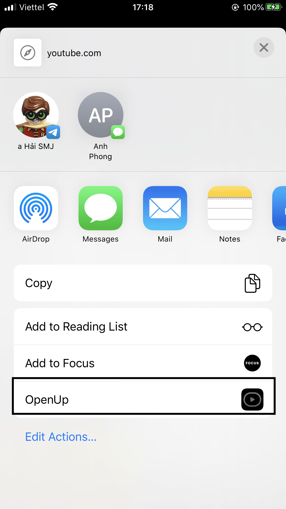
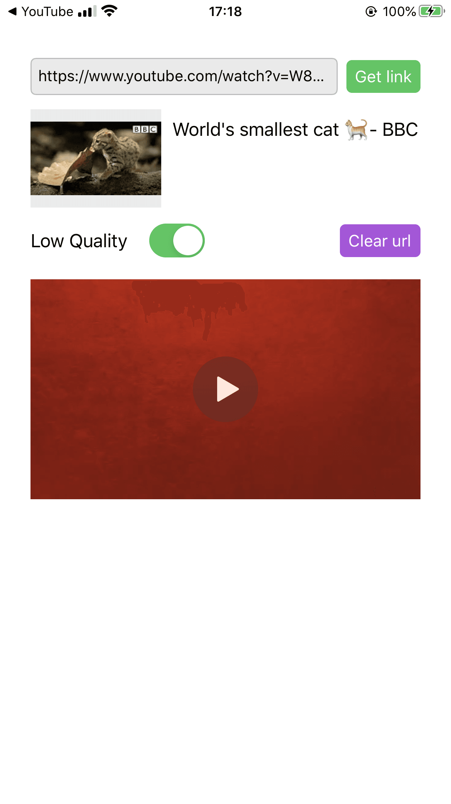
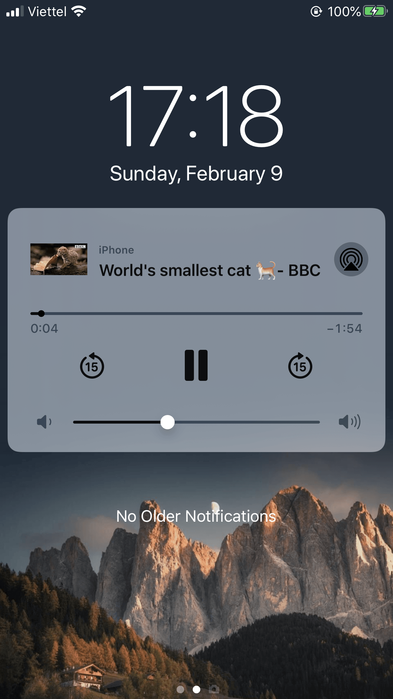

## About

This is action extension support open youtube video into XCDYouTubeKit

## License

Power by XCDYouTubeKit which is available under the MIT license. See the [LICENSE](LICENSE) file for more information.
