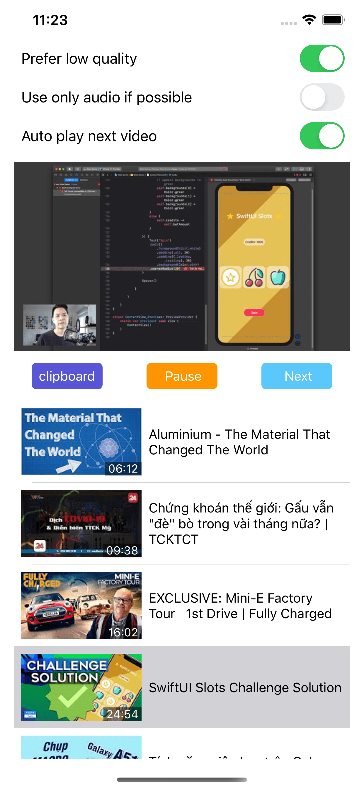

## About

This is action extension support open video youtube in XCDYouTubeKit

## License

Power by XCDYouTubeKit
XCDYouTubeKit is available under the MIT license. See the [LICENSE](LICENSE) file for more information.
